  

  

  

 

  <h2> About </h2>
  

    I am a Computer Science Engineering student at <b>KL University</b>, currently maintaining a <b>9.72 CGPA</b>.
  

  

    My work sits at the intersection of high-performance backend systems, analytical machine learning, and clean UI engineering. I believe software should be built with intention, valuing speed, typography, and human-centric design.
  

  
   

  <!-- Core Focus Areas Grid -->
  <table border="0" cellpadding="10" cellspacing="0" align="center">
    <tr>
      <td align="center" valign="top" width="120">
        
         
        <small><b>Full Stack</b></small>
      </td>
      <td align="center" valign="top" width="120">
        
         
        <small><b>AI &amp; ML</b></small>
      </td>
      <td align="center" valign="top" width="120">
        
         
        <small><b>DSA</b></small>
      </td>
      <td align="center" valign="top" width="120">
        
         
        <small><b>UI Engineering</b></small>
      </td>
    </tr>
  </table>

 

  

 

  <h2>✦ Tech Stack ✦</h2>
  
  
<b>Languages</b>

  

  
   
  
  
<b>Frameworks</b>

  

  
   
  
  
<b>Libraries</b>

  

  
<small>Pandas • NumPy • Matplotlib • Scikit-learn</small>

  
   
  
  
<b>Tools</b>

  

 

  

 

  <h2>✦ Currently Building ✦</h2>
  <table border="0" cellpadding="6" cellspacing="0">
    <tr>
      <td></td>
      <td align="left"><b>Portfolio Website</b> — High-fidelity client architecture &amp; scroll choreographed interactions.</td>
    </tr>
    <tr>
      <td></td>
      <td align="left"><b>AI Projects</b> — Training, evaluating, and serving predictive models.</td>
    </tr>
    <tr>
      <td></td>
      <td align="left"><b>Full Stack Services</b> — Modern, stateless web services built on Express &amp; React.</td>
    </tr>
    <tr>
      <td></td>
      <td align="left"><b>Algorithms</b> — Optimized, native Java implementations of core structures.</td>
    </tr>
  </table>

 

  

 

  <h2>✦ Featured Projects ✦</h2>
   
  
  <table width="100%" border="0" cellpadding="10" cellspacing="0">
    <tr>
      <td width="50%" valign="top" style="border: 1px solid #222222; border-radius: 8px; background-color: #111111;">
        <h3>Portfolio Website</h3>
        
An editorial portfolio inspired by Apple, Linear, and Vercel. Features bespoke scroll choreography, custom typography, and web page transitions.

        

          <a href="https://github.com/sashank321/portfolio"><code>Code</code></a> &nbsp;•&nbsp;
          <a href="https://sashankjunnuru.vercel.app"><code>Live</code></a> &nbsp;•&nbsp;
          React • GSAP • Tailwind
        

      </td>
      <td width="50%" valign="top" style="border: 1px solid #222222; border-radius: 8px; background-color: #111111;">
        <h3> Advertising Sales Analysis</h3>
        
An analytical data science notebook implementing Multiple Linear Regression from scratch to forecast marketing spend return on investment.

        

          <a href="https://github.com/sashank321/advertising-sales-analysis"><code>Code</code></a> &nbsp;•&nbsp;
          Python • Scikit-Learn • Pandas
        

      </td>
    </tr>
    <tr>
      <td height="10" colspan="2"></td>
    </tr>
    <tr>
      <td width="50%" valign="top" style="border: 1px solid #222222; border-radius: 8px; background-color: #111111;">
        <h3> Data Structures &amp; Algorithms</h3>
        
A comprehensive, dependency-free Java repository featuring manual implementations of trees, graphs, custom hash maps, and priority queues.

        

          <a href="https://github.com/sashank321/dsa"><code>Code</code></a> &nbsp;•&nbsp;
          Java • Algorithms • Structures
        

      </td>
      <td width="50%" valign="top" style="border: 1px solid #222222; border-radius: 8px; background-color: #111111;">
        <h3> Full Stack Projects</h3>
        
Various high-performance full-stack web applications deploying robust backends and fast React-driven frontend clients.

        

          <a href="https://github.com/sashank321/fullstack-hub"><code>Code</code></a> &nbsp;•&nbsp;
          React • Node.js • Express
        

      </td>
    </tr>
    <tr>
      <td height="10" colspan="2"></td>
    </tr>
    <tr>
      <td width="50%" valign="top" style="border: 1px solid #222222; border-radius: 8px; background-color: #111111;">
        <h3> AI &amp; ML Experiments</h3>
        
Jupyter Notebooks exploring custom feature engineering, data exploration pipelines, neural architectures, and evaluations.

        

          <a href="https://github.com/sashank321/ai-experiments"><code>Code</code></a> &nbsp;•&nbsp;
          Jupyter • NumPy • Matplotlib
        

      </td>
      <td width="50%" valign="top" style="border: 1px solid #222222; border-radius: 8px; background-color: #111111;">
        <h3> Future Open Source Work</h3>
        
Experimental libraries, automation scripts, and tooling designed to simplify developer workflows and systems integrations.

        

          <a href="https://github.com/sashank321"><code>Profile</code></a> &nbsp;•&nbsp;
          OSS • Automation • CI/CD
        

      </td>
    </tr>
  </table>

 

  

 

 

  

 

  <h2>✦ Developer Metrics ✦</h2>
   
  <!-- Relative path loads the compiled SVG inside Github interface -->
  

 

  

 

  <h2>✦ Contribution Activity ✦</h2>
   
  <!-- Accessing the generated output branch file directly -->
  

 

  

 

  <h2>✦ Connect ✦</h2>
  

    <a href="https://www.linkedin.com/in/sashank-junnuru-63a4b8395/"><b>LinkedIn</b></a> &nbsp;•&nbsp;
    <a href="https://github.com/sashank321"><b>GitHub</b></a>
  

 

  

