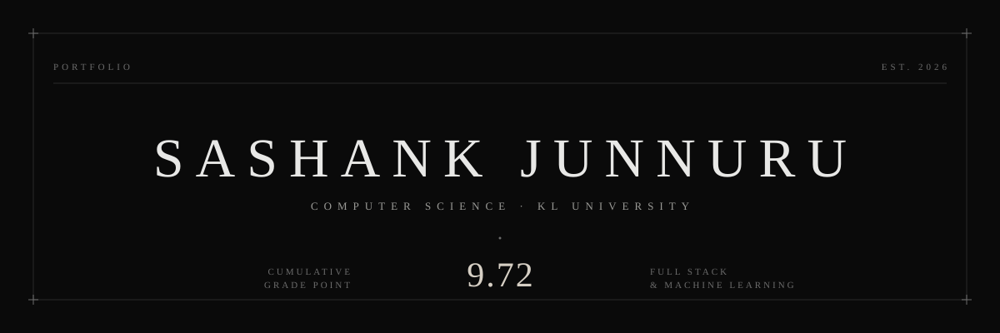

  

  

<!-- Manifesto -->

 

<h1 align="center">Software, designed with intention.</h1>

 

  I am a Computer Science Engineering student at <b>KL University</b>, currently maintaining a <b>9.72 CGPA</b>. 
  My work sits at the intersection of high-performance backend systems, analytical machine learning, and clean UI engineering. 
  I believe software should be built with intention &mdash; valuing speed, typography, and human-centric design.

 

<!-- Focus Areas -->

 

<table border="0" cellpadding="20" cellspacing="0" align="center">
  <tr>
    <td align="center" width="140">
       
      <b>Full Stack</b>
    </td>
    <td align="center" width="140">
       
      <b>AI &amp; ML</b>
    </td>
    <td align="center" width="140">
       
      <b>DSA</b>
    </td>
    <td align="center" width="140">
       
      <b>UI Engineering</b>
    </td>
  </tr>
</table>

 

<!-- Selected Works -->

 

<h2 align="center">SELECTED WORKS</h2>

 

<table width="100%" border="0" cellpadding="14" cellspacing="0">
  <tr>
    <td width="60" valign="top">01</td>
    <td valign="top">
      <b><a href="https://github.com/sashank321/portfolio">Portfolio Website</a></b> 
      A scroll-choreographed personal site &mdash; client architecture, motion as narrative.
    </td>
    <td align="right" valign="top" width="220">
      <a href="https://github.com/sashank321/portfolio">CODE &#8599;</a>&nbsp;&nbsp;<a href="https://sashankjunnuru.vercel.app">LIVE &#8599;</a>
    </td>
  </tr>
  <tr>
    <td width="60" valign="top">02</td>
    <td valign="top">
      <b><a href="https://github.com/sashank321/advertising-sales-analysis">Advertising Sales Analysis</a></b> 
      Regression analysis of advertising spend vs. sales response.
    </td>
    <td align="right" valign="top" width="220">
      <a href="https://github.com/sashank321/advertising-sales-analysis">CODE &#8599;</a>
    </td>
  </tr>
  <tr>
    <td width="60" valign="top">03</td>
    <td valign="top">
      <b><a href="https://github.com/sashank321/dsa">Data Structures &amp; Algorithms</a></b> 
      Java implementations of core structures and algorithmic patterns.
    </td>
    <td align="right" valign="top" width="220">
      <a href="https://github.com/sashank321/dsa">CODE &#8599;</a>
    </td>
  </tr>
  <tr>
    <td width="60" valign="top">04</td>
    <td valign="top">
      <b><a href="https://github.com/sashank321/fullstack-hub">Full Stack Projects</a></b> 
      Express services with React clients.
    </td>
    <td align="right" valign="top" width="220">
      <a href="https://github.com/sashank321/fullstack-hub">CODE &#8599;</a>
    </td>
  </tr>
  <tr>
    <td width="60" valign="top">05</td>
    <td valign="top">
      <b><a href="https://github.com/sashank321/ai-experiments">AI &amp; ML Experiments</a></b> 
      Notebooks on model training, evaluation, and serving.
    </td>
    <td align="right" valign="top" width="220">
      <a href="https://github.com/sashank321/ai-experiments">CODE &#8599;</a>
    </td>
  </tr>
  <tr>
    <td width="60" valign="top">06</td>
    <td valign="top">
      <b><a href="https://github.com/sashank321">Future Open Source Work</a></b> 
      Planned OSS tooling, automation, and CI/CD contributions.
    </td>
    <td align="right" valign="top" width="220">
      <a href="https://github.com/sashank321">PROFILE &#8599;</a>
    </td>
  </tr>
</table>

 

<!-- Stack -->

 

<h2 align="center">STACK</h2>

 

<table border="0" cellpadding="10" cellspacing="0" align="center">
  <tr>
    <td align="right" width="140"><b>LANGUAGES</b></td>
    <td>
      
    </td>
  </tr>
  <tr>
    <td align="right"><b>FRAMEWORKS</b></td>
    <td>
      
    </td>
  </tr>
  <tr>
    <td align="right"><b>MACHINE LEARNING</b></td>
    <td>Pandas &middot; NumPy &middot; Matplotlib &middot; Scikit-learn</td>
  </tr>
  <tr>
    <td align="right"><b>TOOLS</b></td>
    <td>
      
    </td>
  </tr>
</table>

 

<!-- By the Numbers -->

 

<h2 align="center">BY THE NUMBERS</h2>

 

  <!-- Relative path: renders from this repo. Regenerated by a workflow, not a third-party host. -->
  

 

<!-- Contribution Activity -->

 

<h2 align="center">CONTRIBUTION ACTIVITY</h2>

 

  <!-- Accessing the generated output branch file directly -->
  

 

<!-- Connect -->

 

<h2 align="center">CONNECT</h2>

 

  <a href="https://www.linkedin.com/in/sashank-junnuru-63a4b8395/">LINKEDIN &#8599;</a>&nbsp;&nbsp;&middot;&nbsp;&nbsp;<a href="https://github.com/sashank321">GITHUB &#8599;</a>

 

  

